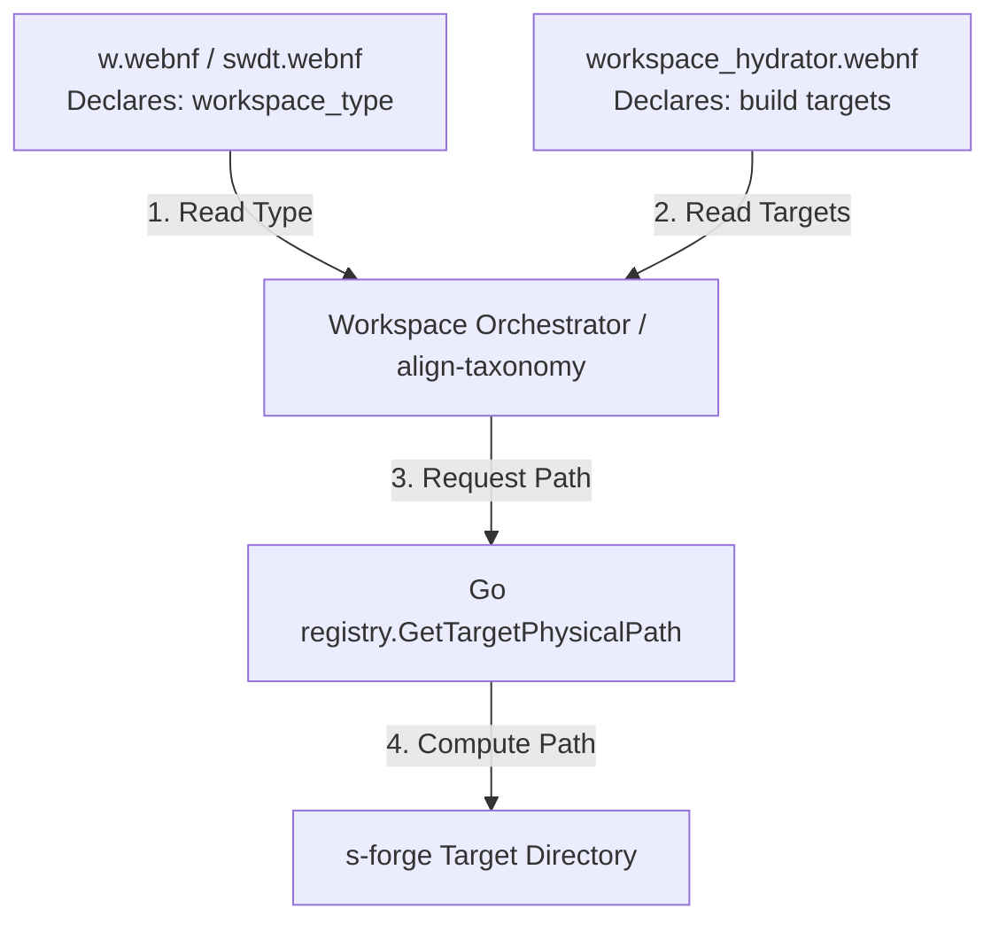

# Workspace DNA & Bazel Harness Linkage Model

This document outlines the decentralized linkage model between a workspace's primary DNA manifest (`w.webnf` / `<workspace>.swdt.webnf`) and its Bazel build harness (`workspace_hydrator.webnf`).

## 1. Core Mental Model

To avoid centralized "god" registries and maintain high flexibility, each workspace controls its own configuration through two decoupled local files:
- **The DNA Manifest (`w.webnf`):** Specifies **what type of thing** the workspace is (its identity and classification).
- **The Build Harness (`workspace_hydrator.webnf`):** Specifies **how** the workspace is built (defining compilation engines, source files, and build targets).

These files are linked locally at the root of the workspace.

---

## 2. Declaring Type in the DNA Manifest (`w.webnf`)

At the root of each workspace, the `<workspace>.swdt.webnf` file contains the primary declaration of the workspace type via `workspace_type`:

```webnf
# s-hydration.swdt.webnf (Workspace DNA)
workspace_name = "s-hydration"
workspace_type = "ACTOR"

last_assessment = "2026-05-23T04:43:28Z"
```

Valid `workspace_type` classification values match the standard taxonomy:
- `ACTOR` (mapped to `99000-internal-actors` or `94000-external-actors`)
- `LIBRARY` (mapped to `98000-internal-libraries` or `93000-external-libraries`)
- `TOOLCHAIN` (mapped to `97000-internal-toolchains` or `92000-external-toolchains`)
- `BINARY` (mapped to `96000-internal-binaries` or `91000-external-binaries`)

---

## 3. Linking in the Bazel Harness (`workspace_hydrator.webnf`)

The local Bazel build harness `workspace_hydrator.webnf` links to the manifest by using the `type` parameter inside its `workspace_harness` block:

```webnf
# workspace_hydrator.webnf (Harness Block)
workspace_harness {
    name : "s-hydration" ;
    
    ; Linkage to the primary workspace type declaration
    type : Manifest.workspace_type ; 

    facets {
        read_only : false ;
        build_enabled : true ;
        functional_classification : "SDLC_CORE" ;
        retention_policy : "PERMANENT" ;
    }
    
    targets {
        target {
            mode : DYNAMIC ;
            engine : "bazel-rules-go" ;
            src : "00flow/s-hydration" ;
            category : ACTOR ;
        }
    }
}
```

---

## 4. How the Harness is Produced & Linked

The build pipeline and workspace orchestrators resolve the linkage as follows:



1. **Production / Initialization:**
   - When `init-workspace` creates a new workspace, it places the default DNA manifest (`w.webnf`) with the appropriate name and default type coordinates.
   - The developer or the workspace orchestrator generates the `workspace_hydrator.webnf` harness specifying build rules for Bazel.
2. **Compilation & Promotion Linkage:**
   - During compilation, `int-rehydrator` reads the workspace harness to verify the targets.
   - It parses the DNA manifest `w.webnf` to resolve the `workspace_type` (e.g. `ACTOR`).
   - It invokes the Go routing registry:
     ```go
     dir, err := registry.GetTargetPhysicalPath("", manifest.WorkspaceType, "internal")
     ```
   - This resolves to the correct physical directory (e.g. `C:\aCogSpaceSeed\00flow\s-forge\99000-internal-actors`) and copies the compiled Bazel harness outputs there.
