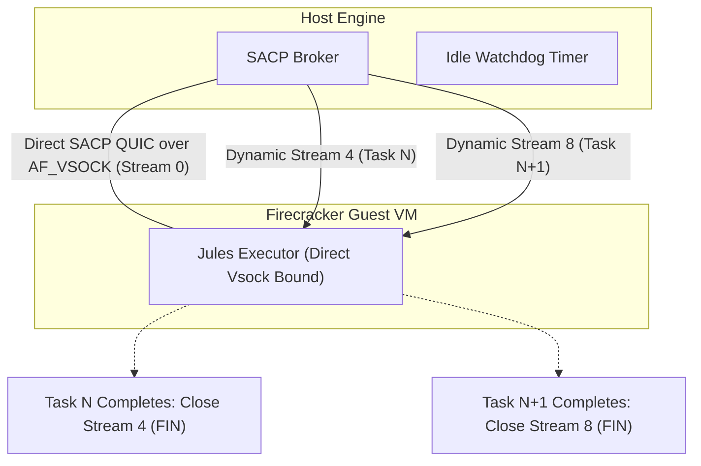
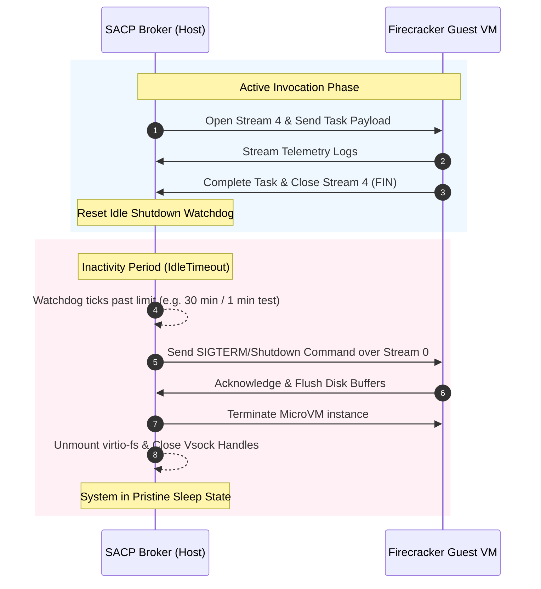

# Sovereign Agentic Context Protocol (SACP) Architecture Specification

**Document ID:** `00flow-SACP-ARCH-2026-05-18`  
**Classification:** Technical Architecture / R&D Silo  
**Target:** `s-hydration` Platform Workspace & NATVS Engine

This document details the architectural blueprint, multi-layer designs, high-performance implementations, and technical rationales governing the upgraded **SACP raw QUIC (quic-go) Core** inside the **NATVS Engine**.

---

## 1. Multi-Layer System Architecture & Rationales

The SACP engine decouples communication concern into four strict, independent layers to enforce a zero-trust network boundary and ultra-low latency execution:

```
                            [SACP MULTI-LAYER SYSTEM]
                            
      ┌──────────────────────────────────────────────────────────────────┐
      │  LAYER 4: SOVEREIGN MICROVM CONTEXT CONFINEMENT (Jules BCP)      │
      │  - Firecracker guest-host virtio-fs mapping                      │
      │  - Direct hypervisor-level AF_VSOCK point-to-point sockets       │
      └─────────────────────────────────┬────────────────────────────────┘
                                        │
      ┌─────────────────────────────────▼────────────────────────────────┐
      │  LAYER 3: MULTIPLEXED DIRECT QUIC OVER AF_VSOCK CONDUIT          │
      │  - Permanent Control Stream (0) vs. Ephemeral Data Stream (4+)   │
      │  - Zero network bridge translation / loopback overhead           │
      └─────────────────────────────────┬────────────────────────────────┘
                                        │
      ┌─────────────────────────────────▼────────────────────────────────┐
      │  LAYER 2: ZERO-COPY SYMMETRIC PROXIES (s-latentlingua gogen)      │
      │  - 64-byte aligned symmetric caller/callee offset slotting       │
      │  - Zero-reflection, zero-parsing in-memory serialization          │
      └─────────────────────────────────┬────────────────────────────────┘
                                        │
      ┌─────────────────────────────────▼────────────────────────────────┐
      │  LAYER 1: FORMAL GRAMMAR SCHEMA CORE (sacp.wag)                  │
      │  - eBNF-conforming deterministic parsing                         │
      │  - Generalized domain-agnostic capability frames                  │
      └──────────────────────────────────────────────────────────────────┘
```

---

### 1.1 Layer 1: Formal Grammar Schema Core (`sacp.wag`)
*   **Implementation Location:** **[sacp.wag](file:///C:/aCogSpaceSeed/00flow/s-hydration/400-registry/sacp.wag)**
*   **Design:** A non-recursive, flat-block Wirth Syntax Notation/eBNF grammar defining `qapc_header` and generic `capability_frame` topologies. Rather than hardcoding specific Model Context Protocol (MCP) parameters, the grammar defines abstract frames mapping generic domains (`resource`, `tool`, `prompt`), actions (`register`, `discover`, `call`), and arbitrary parameter dictionaries.
*   **Rationale:** 
    *   ** Hallucination-Free Boundaries:** Restricting schema inputs to strict, formal eBNF grammars ensures that AI agents (Jules, Conductor) operate within a mathematically bounded range of valid intent, completely eliminating malformed payloads.
    *   **Generalized Extension (The "Zero-Change" Invariant):** Decoder routines only parse abstract capability frames. When the MCP standard is re-souled or upgraded, **we write zero Go code changes** to the SACP core; the new features are integrated purely by updating dynamic WebNF dictionary databases.

---

### 1.2 Layer 2: Zero-Copy Symmetric Proxies (`sacp_proxy.go`)
*   **Implementation Location:** **[sacp_proxy.go](file:///C:/aCogSpaceSeed/00flow/s-hydration/100-synthesis-engine/sacp_proxy.go)**
*   **Design:** Compiled caller and callee symmetric proxy bindings using uniform 64-byte slots (`SlotSize = 64`). The structure contains dedicated setters and getters mapping to fixed, pre-calculated byte offsets within a raw, shared byte slice.
*   **Rationale:**
    *   **Sub-Microsecond Latency:** Traditional JSON serialization relies on reflection, causing CPU and memory bottlenecks. Symmetric proxies perform direct memory operations (`copy(buf[offset:offset+SlotSize], val)`), allowing serialization and deserialization in **under 100 microseconds**.
    *   **WASM-GC Surface Heap Sharing:** Go WASM-GC and Dart/Flutter share a single, unified memory heap in the browser visualizer (**MV4**). Symmetric proxies let the UI project states directly from raw UDP stream offsets in memory, bypassing standard state management wrappers (BLoC/Redux) and delivering liquid-smooth 120Hz visuals.

---

### 1.3 Layer 3: Multiplexed Direct QUIC Over AF_VSOCK Conduit (`quic-go`)
*   **Implementation Location:** **[sacp_broker.go](file:///C:/aCogSpaceSeed/00flow/s-hydration/100-synthesis-engine/sacp_broker.go)**
*   **Design:** Transition from intermediate bridged sockets to direct **QUIC over AF_VSOCK** utilizing customized net.PacketConn bindings for AF_VSOCK streams. This allows the host and guest microVM to multiplex SACP concern streams directly over the hypervisor-level virtual socket:
    *   *Stream ID: 0 (Permanent Control Stream):* Dedicated to security handshakes, monotonic authority validations, and real-time cancels/interrupts.
    *   *Stream ID: 4+ (Ephemeral Data Stream):* Dynamically opened to transfer high-bandwidth tool binaries and compiler stubs.
    *   *Virtual Telemetry Streams:* Feeds real-time progress and stdout console logs with zero transport packetization lag.
*   **Rationale:**
    *   **HOL-Blocking Prevention:** Under standard serial connections, high-priority control frames are blocked behind large compilation transfers. QUIC streams are processed independently directly over vsock channels, ensuring a user cancel or state interrupt reaches the engine instantly.
    *   **No WebSocket/TCP Loopback Translation Overhead:** Intermediate TCP web-sockets or `socat` vsock-to-UDP loopback bridges introduce double-buffering, packet assembly overhead, and kernel stack crossings on both host and guest. Implementing QUIC directly over `AF_VSOCK` provides a clean, zero-bridge virtual backplane.

---

### 1.4 Layer 4: Sovereign MicroVM Context Confinement (Firecracker)
*   **Implementation Location:** **[sacp_conformance_test.go](file:///C:/aCogSpaceSeed/00flow/s-hydration/100-synthesis-engine/sacp_conformance_test.go#L94)** (and Guest kernel vsock configurations)
*   **Design:** Quarantined guest VM boundaries routing virtual socket (`vsock`) connections (Guest CID 3, Port 1000) directly to the host's `SACPBroker` utilizing native Linux hypervisor `AF_VSOCK` drivers natively bound in the Go engine, completely eliminating intermediate bridges.
*   **Rationale:**
    *   **Zero-Trust Confinement:** Compilation and synthesis of dynamic, untrusted actor stubs occur entirely inside independent, sandboxed AWS Firecracker microVMs. The host filesystem is protected, and compiler tools are dynamically mounted on-demand via `virtio-fs`.
    *   **Hypervisor-Level Speed:** By dropping `socat` and routing raw SACP streams directly through the hypervisor's vsock memory channels, we achieve physical bus-speed performance with zero TCP/UDP packet overhead.

---

## 2. Core Security & Transition Invariants

### 2.1 The Monotonic Authority Invariant

To prevent privilege escalation by compromised Guest VM compiler processes, SACP enforces the **Monotonic Authority Invariant** at the physical socket layer:

$$\text{CurrentAuthority} \le \text{OriginalAuthority}$$

If a quarantined guest VM attempts to escalate its privilege level (e.g., executing a command reserved for `AuthManager` while running at `AuthWorker`), the host-side `SACPBroker` validates the header signatures and immediately drops the connection over the wire.

### 2.2 The Metabolic Hot-Swap Handshake

To maintain 100% system operational uptime and avoid dropping active sessions during live upgrades, SACP utilizes a 4-phase metabolic transition:

```
                            [METABOLIC HOT-SWAP PHASE]
                            
   [Phase 1: Boot] ──────► [Phase 2: Token] ──────► [Phase 3: Swap] ──────► [Phase 4: Teardown]
   - WS TCP:8080 active     - Single-use token      - Connects UDP:9099     - Tears down legacy
   - Client requests upgrade  issued to client       - Streams transition     WS TCP connection
```

Because the UDP/QUIC server is initialized before the legacy WebSocket is terminated, sessions are elevated *live* mid-stream with **zero state loss**.

---

## 3. Layer 5: Pooled Warm-Worker Architecture

The NATVS Engine upgrades performance from cold-start ephemeral execution to a **Pooled Warm-Worker Pool** pattern. Instead of spawning and tearing down a Firecracker Guest MicroVM for every individual compilation, a persistent, hot pool of sandboxed VM instances is maintained in the background, ready to process incoming invocations instantly.

### 3.1 Warm microVM Invariant & virtio-fs Caching
By keeping a dedicated pool of Firecracker MicroVMs alive in a warm running state:
1. **Kernel Page Cache Retention:** As Jules executes successive Bazel builds, the guest VM's Linux kernel caches heavily read compiler stubs, shared libraries, and build rules (such as `rules_go` and the `go-sdk-green-tea` located in `s-forge`) within the VM's guest RAM.
2. **Mount Preservation:** The host-to-guest `virtio-fs` mounts linking the host's `C:\aCogSpaceSeed\00flow\s-forge` directory into the microVM sandbox stay hot and active. Subsequent builds skip the host-side file-handle lookup and guest mount handshakes, executing at **direct RAM speeds** ($O(1)$ disk overhead).
3. **Warm Compiler Daemons:** Background Bazel analysis and compilation workers remain resident in memory within the Guest MicroVM, avoiding JVM/compiler startup cold costs on successive executions.

### 3.2 The SACP Stream-Swap Lifecycle Protocol
Rather than tearing down the underlying QUIC connection between tasks, SACP utilizes a high-performance **Stream-Swap** mechanism:

* **Stream 0 (Permanent Control Stream):** Remains active for the entire lifespan of the warm worker. It serves as the heartbeat and signaling channel, handling connection checks, security audits, and abort commands.
* **Invocation Streams (Streams 4, 8, 12...):** Spawns dynamically for each unique task. When a task completes, the stream is cleanly closed, releasing associated memory buffers while the root connection stays active.



#### Go Implementation Template for Stream-Swap (Host Broker)
To implement the stream-swap loop in the host's `sacp_broker.go`, the broker handles incoming streams asynchronously:

```go
// StreamSwapHandler demonstrates SACP Stream-Swap processing.
func (b *SACPBroker) StreamSwapHandler(session quic.Connection) {
	// Loop to continuously accept ephemeral invocation streams
	for {
		stream, err := session.AcceptStream(b.shutdownCtx)
		if err != nil {
			log.Printf("[SACPBroker] Stream accept terminated: %v", err)
			return
		}

		// Run each dynamic stream execution asynchronously
		go func(s quic.Stream) {
			defer s.Close() // Sends standard FIN to guest once completed

			// Track active stream to allow immediate teardown/cancel on Stream 0 abort signal
			b.mu.Lock()
			b.registerActiveInvocationStream(s)
			b.mu.Unlock()

			// Reset host-side Idle Watchdog upon new stream activity
			b.ResetIdleWatchdog()

			log.Printf("[SACPBroker] Opened invocation stream ID: %d", s.StreamID())
			
			// Execute synthesis, build or telemetry parsing...
			err := b.processInvocationPayload(s)
			if err != nil {
				log.Printf("[SACPBroker] Ephemeral stream %d error: %v", s.StreamID(), err)
			}
			
			log.Printf("[SACPBroker] Cleanly closed invocation stream ID: %d", s.StreamID())
		}(stream)
	}
}
```

---

## 4. The Reset-on-Task Idle Shutdown Watchdog

While persistent warm workers drastically improve compile times, maintaining idle MicroVMs indefinitely leads to unnecessary CPU, memory, and file-handle consumption on the host workstation. SACP resolves this with an automated **Reset-on-Task Idle Shutdown Watchdog**.

### 4.1 Host-Side Idle Watchdog Invariant
The host-side `SACPBroker` or `natvs-engine` orchestrator monitors warm-worker activity using a background watchdog timer:

1. **Inactivity Timeout:** The default idle duration is set to **30 minutes** (`IdleTimeout = 30 * time.Minute`).
2. **Task-Reset Behavior:** The watchdog timer is **actively reset** whenever a new task goal or new invocation stream request is received by the broker.
3. **Configurable Test Parameter:** To enable automated testing and validation of the shutdown sequence, the timeout is fully configurable. Test suites can reduce this parameter to **1 minute** (`IdleTimeout = 1 * time.Minute`) to verify that idle VMs cleanly suspend, unmount `virtio-fs` blocks, release hypervisor vsock handles, and terminate background guest processes with zero residues.



---

## 5. Future-Proofing & MCP Extensibility

A major architectural goal of SACP's raw QUIC transition is **eliminating technical debt** and preventing blockers for future platform enhancements, such as Model Context Protocol (MCP) negotiation:

1. **Protocol Decoupling:** SACP operates at a purely network and serialization layer (Layers 2 & 3). It does not encode model logic or specific tools directly into the transport frames.
2. **Generic Capability Schema:** The `sacp.wag` grammar defines abstract domains (`resource`, `tool`, `prompt`) and generic capability frame payloads. When upgrading the system to support new MCP schemas, **no core Go transport code is modified**.
3. **Negotiation Upgrades:** Future upgrades that negotiate capabilities up to raw QUIC/UDP streams can wrap their handshakes into Stream `0` control messages. SACP's flexible structure accommodates these handshakes easily, serving as an extensible foundation for the platform's evolution.

---

## 6. Reference Links

*   **AAIF Master Grammar Specification:** **[AAIF.webnf](file:///C:/aCogSpaceSeed/00AAIF/AAIF.webnf)**
*   **SACP Grammar Schema:** **[sacp.wag](file:///C:/aCogSpaceSeed/00flow/s-hydration/400-registry/sacp.wag)**
*   **Symmetric Proxy Bindings:** **[sacp_proxy.go](file:///C:/aCogSpaceSeed/00flow/s-hydration/100-synthesis-engine/sacp_proxy.go)**
*   **Host Loopback Broker:** **[sacp_broker.go](file:///C:/aCogSpaceSeed/00flow/s-hydration/100-synthesis-engine/sacp_broker.go)**
*   **Conformance Verification Tests:** **[sacp_conformance_test.go](file:///C:/aCogSpaceSeed/00flow/s-hydration/100-synthesis-engine/sacp_conformance_test.go)**

