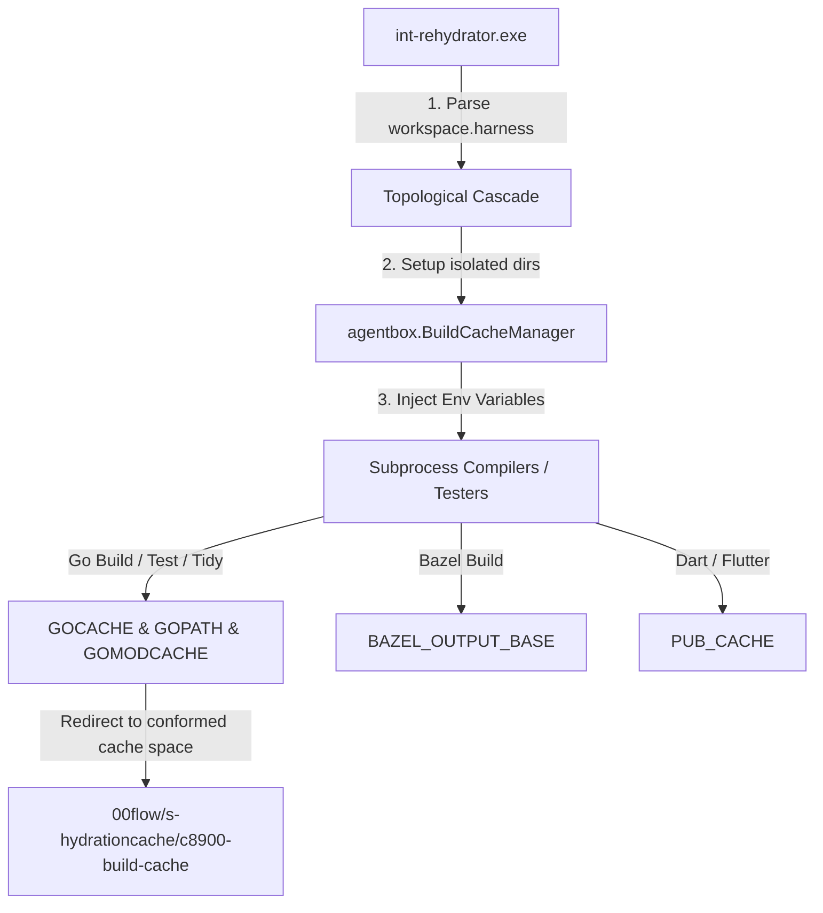

# Sovereign Hydration Architecture

## 1. Executive Summary
The Sovereign Hydration engine (`sov-hydrator.go`) is a highly concurrent, fully air-gapped dependency ingestion orchestrator for the NATVS-engine pipeline. Designed to be a single, unified, 100% portable Go binary, it compiles flawlessly across Windows 11 Pro, Linux, and future macOS platforms. The engine establishes Bazel sovereignty by retrieving external dependencies, metabolically pruning them against explicit capability lists, verifying cryptographic seals, and securely promoting them to the `s-forge` internal registry.

## 2. Core Architectural Components

### 2.1 Single-File Cross-Platform Portability
- **Native Implementation:** All OS-dependent shell executions (such as PowerShell `Copy-Item`) have been replaced with a native, pure Go non-recursive DFS copy mechanism (`CopyDirectory`).
- **Unified Build:** The system is governed by a single Go source file without complex multi-file build tags or OS-specific C/C++ dependencies. 
- **Storage Metrics:** Uses a simplified, cross-platform agnostic stub for storage metric aggregation to guarantee compilation anywhere without NT-kernel or POSIX `statfs` collisions.

### 2.2 SovereignScaler: Dynamic Concurrency
- **HTTP/3 QUIC Multiplexing:** Leverages QUIC streams over a single UDP socket connection to bypass HTTP/2 TCP head-of-line blocking and maximize throughput against the same host (e.g., github.com).
- **Elastic Throttling:** Concurrency scales dynamically from N=2 up to N=8 based on target payload sizes and historic network throughput metrics recorded in the `Experience Registry`.
- **Topological Scheduling:** Massive artifacts (>100MB) are relegated to a dedicated sequential queue, while smaller bootstrap dependencies are processed in massive parallel bursts to prevent disk thrashing.

### 2.3 The NATVS Lifecycle & "Defense against the Dark Arts" Ingress
Our strict intake security pipeline (internally referred to as "Defense against the dark arts") runs inside the ephemeral ingestion sandbox (`c0990-ephemeral-scratch`) to prevent untrusted code, CVEs, or viral licensing from entering the `s-forge` perimeter. The ingestion sequence executes the following phases:

1. **Metabolic Pruning**: DFS graph traversal deletes unnecessary bloat (such as non-target OS binary distributions, tests, examples, and documentation) while strictly preserving copy/legal compliance statements (`license`, `copying`, `patents`).
2. **Environmental Dependency Resolution (Go Module Tidy)**: Before running security audits, the hydrator performs Go module dependency resolution (`go mod tidy` with `GOWORK=off` on the local module) inside the shadow directory. This aligns the third-party module's internal dependency tree with our secure environment's global version constraints, neutralizing potential transitive CVEs before the scanner executes.
3. **Offline Security Scan**: Runs a static vulnerability scan via Trivy filesystem mode to block any dependencies carrying `HIGH` or `CRITICAL` vulnerability signatures.
4. **License Compliance Enforcement**: Scans for copyleft licensing keywords (e.g. AGPL, GPL v3, Affero, System-Wide Copyleft) and blocks promotion to prevent viral copyleft leaks.
5. **Attestation & Cryptographic Sealing**: Employs pure Go, in-process Blake3 (`sov.fleet/blake3`) or SHA-512 cryptographic verification to seal the vetted package directory, auto-updating the SBOM database (`sbom.external_artifact.webnf`).
- **Category-Based Metadata Classification:** The offline ingestion registry is governed by the `external_artifact.wag` WAG grammar, which partitions registry entries into explicit `CLI` and `LIBRARY` categories to prevent prefix name-overloading.

### 2.4 "If We Gotta NPM, Here is Our Protection" Confinement
To ingest external toolchains distributed exclusively via NPM (such as the `jules` CLI) while strictly enforcing our node/npm-free host environment policy, we deploy two isolation layers:
1. **Direct Host-Side Tarball Filtering**:
   * Instead of invoking the NPM package manager, the engine retrieves package tarballs (`.tgz` / `.tar.gz`) directly from the registry over a static HTTP request (completely safe, zero execution risk).
   * It scans the archive files in-memory using pure Go `compress/gzip` and `archive/tar` streams. It identifies and copies ONLY the platform-specific native executable binary (e.g. `jules.exe`), completely discarding all Javascript files (`.js`, `.cjs`, `.mjs`), config files, and pre/postinstall package scripts to prevent host-side execution.
2. **Network-Isolated Podman Confinement**:
   * If a package requires dependency resolution or script-based build hooks to produce the native executable, the installation is fully confined inside a transient **Podman** container inheriting from a minimal Node Alpine image.
   * The container is built and run with **network access disabled** (`--network none`) and **read-only root mounts** (`--read-only`). The downloaded tarball is mounted in isolation, NPM runs the install script within container boundaries (preventing telemetry leaks or internet-based malware downloads), the compiled output binary is copied out, and the container is immediately destroyed.

## 3. Experience Registry
The engine maintains a historical database (`hydration_experience.webnf`) that chronicles prior ingestion durations, original payload sizes, expanded volume footprints, and pruned footprints. This persistent "memory" enables the SovereignScaler to intelligently partition work across hosts based on predictive timing rather than static rules.

## 4. A/B Test Validation & Optimization

### 4.1 Real-World Metrics Verification
An integrated live A/B Acid Test campaign (`-abtest`) isolates the performance delta between forced-sequential scheduling (N=1) and dynamic QUIC-multiplexed parallel scheduling. 

**Acid Test Results Example:**
```text
=====================================================================================
                         SOVEREIGN HYDRATOR A/B TEST REPORT
=====================================================================================
  TARGET ARTIFACT                | SEQUENTIAL DURATION  | PARALLEL DURATION    | SPEEDUP   
-------------------------------------------------------------------------------------
  bazel-rules-flutter            | 220ms                | 68ms                 | 3.24x     
  bazel-rules-go                 | 1.94s                | 2.201s               | 0.88x     
  bazel                          | 706ms                | 2.039s               | 0.35x     
  buildifier                     | 611ms                | 2.039s               | 0.30x     
  step-ca                        | 1.342s               | 2.521s               | 0.53x     
-------------------------------------------------------------------------------------
  GLOBAL PROCESS TOTALS          | 4.819s               | 2.589s               | 1.86x Faster
=====================================================================================
```

### 4.2 Engineering Advancements & Corrections
- **Queue Wait Time Cancellation:** Extracted target download durations are precision-corrected by capturing queue lock wait times. This ensures parallel targets waiting inside the extraction bottleneck FIFO queue do not artificially inflate their parallel execution durations.
- **Target Bay Sanitation:** `s-forge` promotion paths are wiped cleanly before `CopyDirectory` executes, providing a residual-free release state.
- **Minimal Disk Footprint ($O(1)$ Storage Overhead):** Ephemeral shadow verification paths are eradicated instantaneously inside the lock's critical section, guaranteeing that gigabytes of parallel unzipped payload do not stack simultaneously on workstation solid-state drives.
- **Automatic Workstation Cleanup on Test Builds:** When running A/B testing or dry-runs using the `-test-build` command-line flag, targets are promoted to local workstation directories inside the `s-hydration` workspace (e.g., `s-hydration/97000-internal-toolchains/`) for offline validation. To prevent local workspace pollution, a deferred cleanup routine (`cleanLocalWorkstationExecutables`) runs automatically upon termination, sweeping and removing all staged test binaries (`.exe`, `.dll`, etc.) from these folders to maintain a clean git state.


## 5. Deployment Commands
- **Standard Pipeline:** `go run sov-hydrator.go`
- **A/B Acid Test Campaign:** `go run sov-hydrator.go -abtest -only "bazel-rules-flutter,bazel,buildifier"`
- **Strict Sequential Mode:** `go run sov-hydrator.go -sequential`

## 6. End-to-End Ingress Verification Flow
The diagram below maps the complete verification loop starting from human registration inputs to deterministic processing and final silo promotion:

```mermaid
graph TD
    %% Phase 1: Input to Manifest
    A["Human / Operator Input"] -->|Defines Dependency & Policy| B["external_artifact.wag WAG Grammar"]
    B -->|Deterministically Validates Syntax| C["Manifest DB (sbom.external_artifact.webnf)"]
    
    %% Phase 2: Ingress & Processing
    C -->|Read Target Registrations| D["Sovereign Hydrator Engine"]
    D -->|QUIC / HTTP3 Persistent Cohort Cohorts| E["Remote Artifact Source"]
    E -->|Download Archive| F["Ephemeral Sandbox (c0990-ephemeral-scratch)"]
    
    %% Phase 3: Defense against the Dark Arts
    F -->|Analyze Source| P{"Is NPM Package?"}
    P -->|Yes: BuildPolicy=NPM_PODMAN| Q["Network-Isolated Podman Sandbox<br>(--network none, --read-only)"]
    P -->|Yes: Default / BINARY_ONLY| R["Go-Native Tarball Stream Parser<br>(In-Memory Scan, Write ONLY Executable)"]
    P -->|No| S["Standard Unzip / UnTgz Extract"]
    
    Q -->|Extract Native Binary| G["Metabolic Pruned Code"]
    R -->|Extract Native Binary| G
    S -->|Prune Files & Bloat| G
    
    G -->|2. Environmental Dependency Alignment| H["go mod tidy (GOWORK=off)"]
    H -->|3. Filesystem Security Audit| I{"Trivy Scan: CVE Found?"}
    I -->|Yes| J["CRITICAL BLOCK (Bailout/Error)"]
    I -->|No| K{"4. Copyleft License Audit"}
    K -->|Viral License Found| L["COMPLIANCE BLOCK (Bailout/Error)"]
    K -->|Approved License| M["5. Attestation & Cryptographic Sealing"]
    
    %% Phase 4: Sealing & Promotion
    M -->|Write Verified Blake3/SHA512 Seal| N["Update Manifest DB (sbom.external_artifact.webnf)"]
    M -->|Atomic Bay Promotion| O["Vetted Silo (s-forge internal registry)"]

---

## 7. Sovereign Rehydration Lifecycle Pattern

Depending on whether we are hydrating third-party external code or compiling first-party internal workspaces, the lifecycle splits into two pathways (external vs. internal):

```mermaid
graph TD
    subgraph "External Rehydration Flow (ext-rehydrate)"
        A1["Human Choice / Operator"] -->|Registers package + URL| B1["External Manifest (sbom.external_artifact.webnf)"]
        B1 -->|Defines inputs for| C1["ext-rehydrate Command"]
        C1 -->|Passes source to| D1["Purifier Engine"]
        D1 -->|Runs purification steps: verification, pruning, scan, compile| E1["Hardened Artifact & Conformed SBOM Seal"]
    end

    subgraph "Internal Rehydration Flow (int-rehydrate)"
        A2["Human Choice / Workspace Creation"] -->|Configures files & code| B2["Go Workspaces (go.work is the Manifest)"]
        B2 -->|Defines targets for| C2["int-rehydrate Command"]
        C2 -->|Passes source to| D2["Purifier Engine"]
        D2 -->|Runs purification steps: compilation, signing, validation| E2["Staged Workspace Binary / Artifact"]
    end
```

---

## 8. Direct Bazel Integration & Compiled Go Alignment Tooling

To ensure optimal speed, reproducibility, and local air-gapped security, all build and testing steps are designed around direct, conformed toolchain usage:

- **Direct Bazel Usage**: The platform utilizes a single, authoritative `bazel.exe` stored locally in the registry (`00flow/s-forge/92000-external-toolchains/bazel/bazel.exe`). Wrapper utilities like `bazelisk` are completely bypassed because the platform strictly manages a unified Bazel version directly, avoiding downstream version mismatches or on-the-fly binary downloads.
- **Verification Routing via Bazel**: When the `-bazel-test` flag is passed to the rehydrator, all workspace attestation verifications are routed through `bazel test //...` inside isolated sandbox cache directories (`BAZEL_OUTPUT_BASE`), eliminating direct `go test` executable invocations.
- **Go Programmatic Operations (mod_aligner)**: We enforce Go-native compilation programs (like `mod_aligner`) to resolve, rewrite, and align local workspace modules. This replaces manual LLM editing of `go.mod` files, ensuring $O(1)$ latency and zero semantic drift when compiling Go workspace layouts.


## 9. Environment-Based Build Cache Orchestration (cache.go)

To eliminate symbolic folder links/junctions and prevent concurrent build resource conflicts, the build system delegates all cache directory management and environment variable configuration to the `BuildCacheManager` defined in `s-agentbox/agentbox/cache.go`.

### 9.1 Orchestration Workflow

The diagram below details how the isolated caches are setup, resolved, and injected into Go, Dart, Flutter, and Bazel compilers:



### 9.2 Cache Isolation Matrix
* **Go Compiler (`GOCACHE` / `GOPATH`):** Creates temporary, workspace-isolated cache directories under `c0990-ephemeral-scratch/build-caches/<workspace-name>` to prevent lock collisions during concurrent workspace runs.
* **Go Module Cache (`GOMODCACHE`):** All third-party Go dependencies are resolved and cached strictly inside `00flow/s-hydrationcache/c8900-build-cache` to ensure complete hermeticity within the workspace and prevent reliance on OS-level home folder caches.
* **Bazel Compiler (`BAZEL_OUTPUT_BASE`):** Isolates the Bazel compilation user root for each workspace target, ensuring parallel Bazel builds do not pollute or conflict with each other.
* **Dart/Flutter (`PUB_CACHE`):** Redirects package downloads to localized worktree-specific folders.


